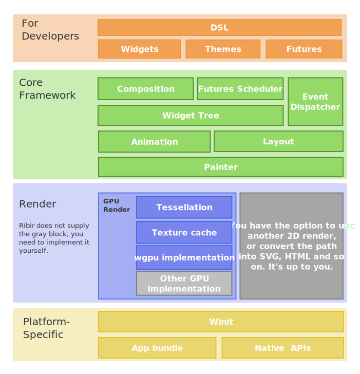

# Ribir v0.1.0

After several years of conception, especially the hard work of the past year, we are proud to announce that Ribir v0.1.0 is finally released. 

## What is Ribir?

Ribir is an open-source Rust GUI framework that helps you build beautiful and native multi-platform applications from a single codebase.

The architecture overview of Ribir:

## Build your UI non-intrusive

The most important goal of Ribir is to let you build your UI directly based on your data structure APIs. Any data mutation will trigger a precise UI update. Your focus should be on designing your data structure and its APIs. Then, you can describe your data's UI without intruding on its logic.

You can abstract your App data structure first and then describe your UI based on its APIs. This process does not necessitate any pre-design of the data structure.

- No additional states
- No additional notification mechanisms 
- No inheritance of any base classes
- No other pre-constraints. 

## Why Rust?

Building a high-performance cross-platform framework that compiles natively, we had two options within our purview: C++ and Rust.

Initially, we were more inclined to choose C++, because C++ has a more mature ecosystem, and we have years of experience in developing large tools based on C++. Although we have been learning and writing Rust for many years, to be honest, we have not used it extensively in a production project. Ultimately, the two core reasons that led us to choose Rust are:

- The `trait`: Using Rust traits to implement our non-intrusive design feels so natural.
- Procedure macro: Using Rust's procedural macros for our DSL implementation eliminates the need for extra tools. When combined with Rust's toolchain, it offers an out-of-the-box solution, enhancing the overall development experience.

## What is the current status of Ribir?

The goal of the first version of Ribir is to finish the core framework and answer our questions about the feasibility of the design.

We use it to build examples and build some apps for our daily work. And we are satisfied with the experience of using it.

Although we implemented almost all the core features in the first version of Ribir. That seems you can use it to do many things. You need to know that it is still in a very early stage:

- We only test and use it in a very limited environment 
- There exist several known issues, including memory leaks and performance-related concerns, that are still awaiting resolution.
- Many APIs may break in the next version

So, we are very happy to share it with you. We hope you can try it out and give us feedback. But we don't recommend you to use it in production environments yet.

## The next step

After the first version of Ribir, it's time to turn us to a more practical direction. We are confident that we will iterate quickly and stable more features that the production environment needs.

The next version of Ribir will focus on the following things:

- Enable WebAssembly support, so we can build web apps and share demos online.
- Introduce a stable and user-friendly overlay system to elegantly handle tooltips, popups, and other overlay UI elements.
- Stabilize the APIs of BuiltinObj and state, allowing for automatic cycle-reference breaking and memory leak prevention in most scenarios, and providing a reliable option for state unsubscribing.

## Changelog

The detailed changelog is available in the [CHANGELOG.md](https://github.com/RibirX/Ribir/blob/master/CHANGELOG.md)

## Feedback

Welcome to feedback and star our repo on [GitHub](https://github.com/RibirX/Ribir)